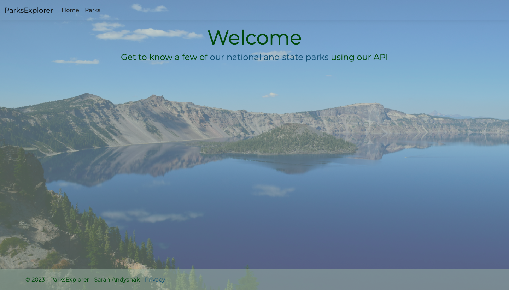
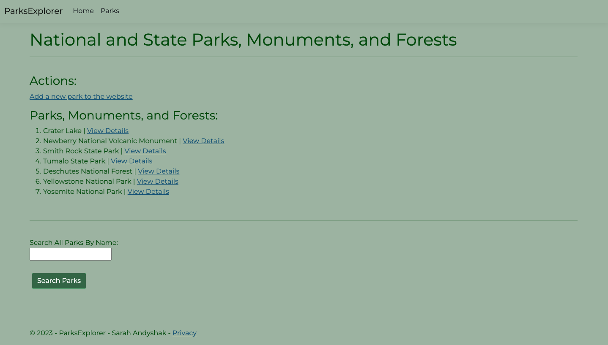
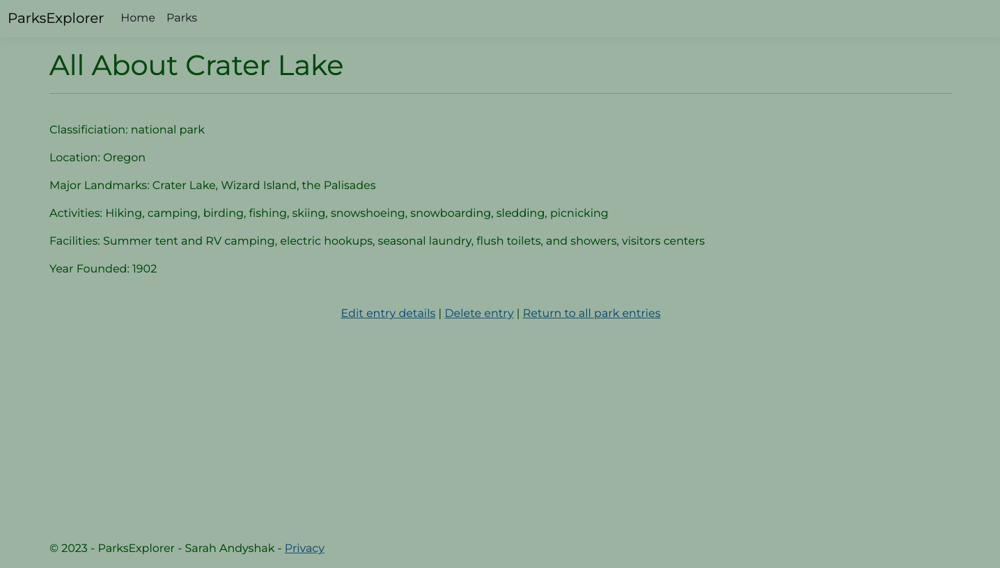

## 🌲🏞️ Parks Explorer 🏞️🌲

#### By Sarah Andyshak

#### An MVC website exploring national and state parks, monuments, and forests, calling on the ParksDirectory API.

## Technologies Used 

* C#
* .NET
* ASP.Net
* Entity Framework
* HTML
* CSS

## 🌲 Description

A website to help you explore the US national parks system. 

Screenshots from this site:

## 🌲 How To Run This Project

### What Is This?

This project (the Parks Explorer) is based on the following classwork on LearnHowToProgram.com:

- https://www.learnhowtoprogram.com/c-and-net/building-an-api/mvc-client-getall
- https://www.learnhowtoprogram.com/c-and-net/building-an-api/mvc-client-getdetails
- https://www.learnhowtoprogram.com/c-and-net/building-an-api/mvc-client-post-put-and-delete

Finally, this project was scaffolded using [`dotnet new`](https://learn.microsoft.com/en-us/dotnet/core/tools/dotnet-new).

### Install Tools

Install the tools that are introduced in [this series of lessons on LearnHowToProgram.com](https://www.learnhowtoprogram.com/c-and-net/getting-started-with-c).

### Set Up and Run the ParksDirectory API Project

First, following the instructions in the README of [this repo](https://github.com/epicodus-lessons/section-6-cretaceous-park-api-csharp-net6) to set up and run the ParksDirectory API.

### Set Up and Run This Project

1. Clone this repo.
2. Open the terminal and navigate to this project's production directory called "ParksExplorer".
3. Within the production directory "ParksExplorer", run `dotnet watch run` in the command line to start the project in development mode with a watcher.
4. Open the browser to _https://localhost:7044/_. If you cannot access https://localhost:7044 it is likely because you have not configured a .NET developer security certificate for HTTPS. To learn about this, review this lesson: [Redirecting to HTTPS and Issuing a Security Certificate](https://www.learnhowtoprogram.com/lessons/redirecting-to-https-and-issuing-a-security-certificate).

## Known Bugs

* As of 31 March 2023, updates (save, edit, delete actions) lag and the page needs to be refreshed for changes to be applied (when using a Mac).

## License
Enjoy the site! If you have questions or suggestions for fixing the code, please contact me!

[MIT](https://github.com/git/git-scm.com/blob/main/MIT-LICENSE.txt)

Copyright (c) 2023 Sarah Andyshak